# Vintage Cars
***
 
## Table of Contents:
* [What does it do and what does it need to fulfill?](#what-does-it-do-and-what-does-it-need-to-fulfill)
* [Functionality of Project](#functionality-of-project)
* [User Experience](#user-experience)
   * [User Stories](#user-stories)
   * [Design](#design)
       * [1. Font](#1-font)
       * [2. Color Scheme](#2-color-scheme)
       * [3. Logo](#3-logo)
       * [4. Wireframing](#5-wireframing)
* [Technology Used](#technology-used)
* [Database](#database)
* [Features](#features)
   * [Future Features](#future-features)
* [Testing](#testing)
   * [Defensive Design](#defensive-design)
* [Deployment](#deployment)
* [Credits](#credits)
   * [Special Thanks & Acknowledgements](#special-thanks--acknowledgements)
 
***
 
## Welcome to Vintage Cars!

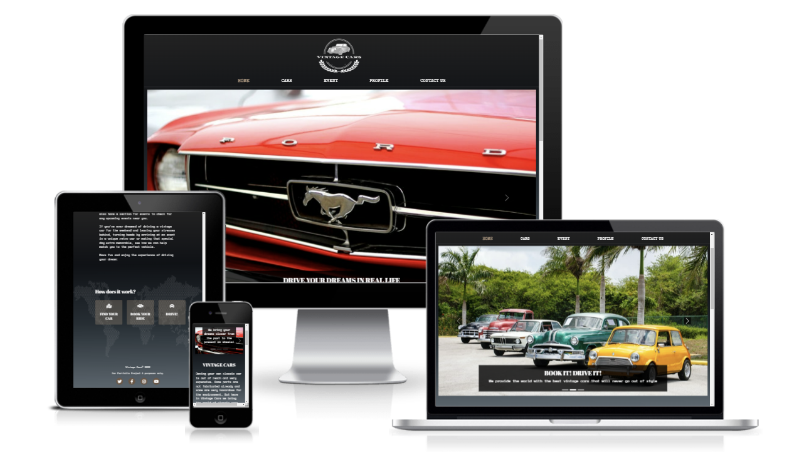
 
***
 
## What does it do and what does it need to fulfill?

Ever since automotives were invented, they were evolving very fast and even more environmentally friendly. But there are old cars that, though time already passes, are still as good as the modern ones. It’s good to point out that the world is accumulating a lot of garbage and, instead of scrapping the old unused cars, it should be integrated into circulation again but lessen their emission of contaminant gas.

With this project, I want to showcase the simplicity but elegant style of these cars and to be able to reuse these cars for different purposes and to promote them back into circulation with the help of modern technology. It's also a good opportunity for owners to gain cash by sharing their properties to avid fans of classic and vintage cars.

This project is to show how easy and fast a single framework can build a real-life website with complete functionality and libraries to choose from. Django is an open-source web framework that provides an easy and efficient way to create websites with minimum hassles. It comes with resources that are required by developers, specially those who are just starting their journey in Software Development.

 

### Favicon
I opted to use an image of a very well known classic car as the favicon of my project.

 

### Functionality of Project

There are different functionalities that are implemented in this project. One of them is to be able to register, to log in the registered username and to log out.

Any users, general users and registered users can view and read any post created. Those posts are created only by registered users. It can also be updated or deleted only by the author.

The Events section is integrated to the web page where anyone can browse to different upcoming events. Only admin staff can create, update and delete these posts. The rest of users can only read the content.
A contact page is available for anyone who wants to rent a car or has any enquiry regarding a car, a post or the webpage.

 
[Back to top](#table-of-contents)
 
## User Experience:
 
### User Stories:
_Generic (Guest/Public) User:_
* As a Generic User, I want to browse through different types of classic cars.
* As a Generic User, I want to be able to filter out the cars that are available for rent.
* As a Generic User, I want to see reviews of some users in the comment section.
* As a Generic User, I want to be able to read about any upcoming event in the future.
* As a Generic User, I want to be able to rent my favorite car.
* As a Generic User, I want to contact the website for any enquiries.
 
 

_Registers (Logged in) User:_
* As a Registered User, I want to be able to enjoy a ride with my favorite classic cars by renting one anytime.
* As a Registered User, I want to enjoy the car without worrying about the car expenses and maintenance.
* As a Registered User, I want to be a part of a community of avid fans of classic and vintage cars.
* As a Registered User, I want to post, edit and delete a classic car.
* As a Registered User, I want to filter my posts so that I can manage them all, more especially those posts pending to be published.
* As a Registered User, I want to be able to view any upcoming event and be able to be part of it.

 

_Administrator:_
* As an Administrator, I want to promote a very friendly community who wants to help and share with other users.
* As an Administrator, I want to notify the whole community about upcoming events regarding classic cars anywhere.

 

_Developer:_
* As a Developer, I want to to be able to make a fully functioning webpage.
* As a Developer, I want to use and apply the different languages I learned.
* As a Developer, I want to upgrade my knowledge to gain more skills.

 

### Design
 
#### 1. Font
Google fonts were used in this project. For the heading, `PLAYFAIR DISPLAY` was used to give it a vintage but elegant vibe. For the navbar font and some other area, `SPECIAL ELITE` was used to apply a look of an old typewriter style. For the rest of the website `SPACE MONO` was used.

 

#### 2. Color Scheme

Black is mainly used throughout the project. It provides elegance and simplicity. I used other colors to add more life and appeal to the page.

The main page background belongs to Shecodes gradient color palette for students/alumni to use in their projects. I did some modifications of the colors follow the chosen color scheme.

The background gradient color code is `linear-gradient(179.2deg, rgb(34, 34, 34) 0%, rgb(15, 18, 22) 29.7%, rgb(37, 47, 53) 63.4%, rgba(49, 65, 75, 0.8) 100.1%)`

The rest of the colors I used are as follows:

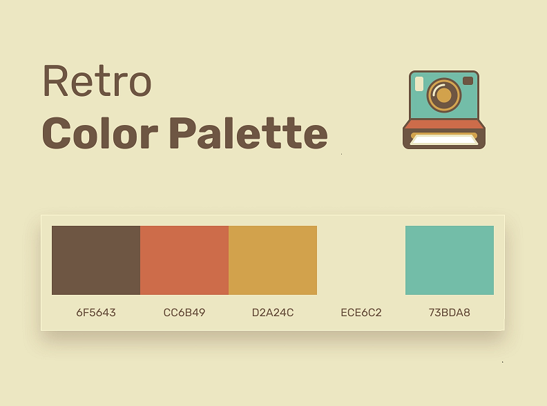

* Red color: `#CD6C4A`

* Light brown color: `#b1987f`

* Brown: `#6F5643`

* White: `#f3f3f3`

* Orange: `#D2A24C`

* Yellow: `#ECE6C2`

* Green: `#73BDA8`

 

#### 3. Logo

The logo was created in a free application that allows users to create logos. I chose the LOGO MAKER app because it has extensive designs, especially vintage designs. And it’s also free of charge and it can be created with a transparent background.

The logo has three parts. Across in the middle is the name of the project: VINTAGE CARS. An image of a classic car enclosed by a circle was provided by the app which gives an obvious meaning to the page. And the laurel underneath signifies honor and distinction.
 

 
 
#### 4. Wireframing
 
The wireframes were created for each individual page on three different screen sizes and two different mobile devices.
 

#### The home page
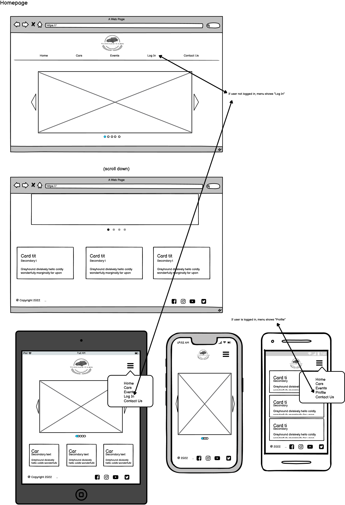

Here are the rest of the wireframes:

Cars page

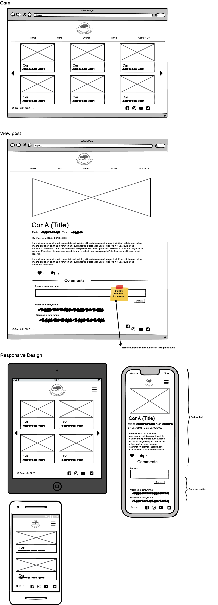

Events page

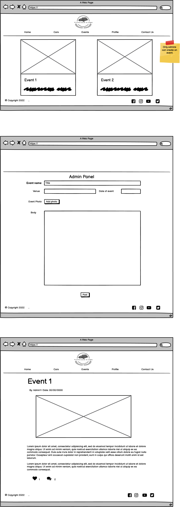

Log in and Sign up page

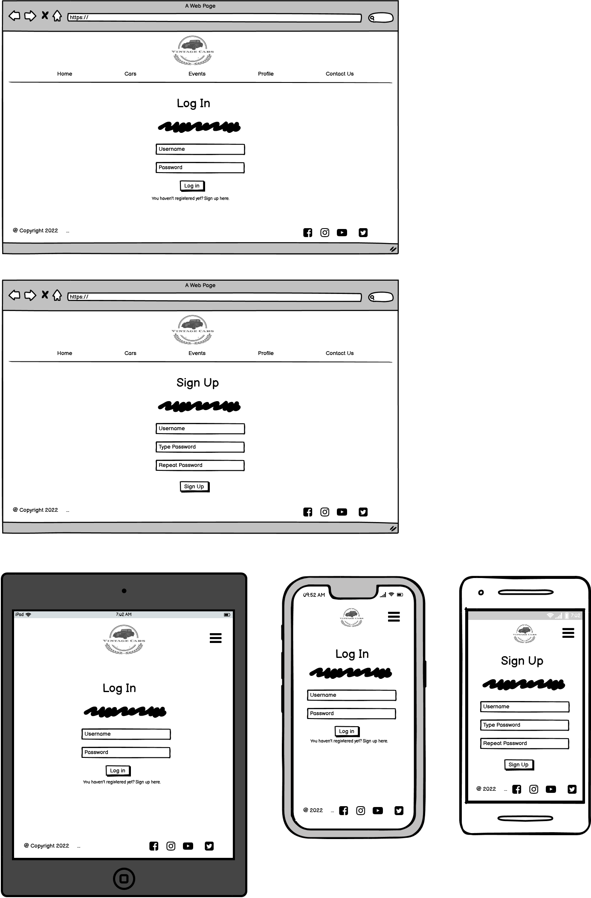

Profile page in browser view

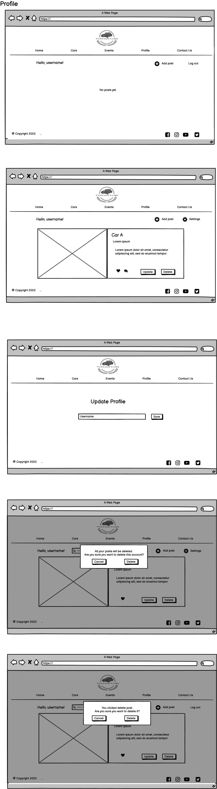

Profile page in medium and small devices

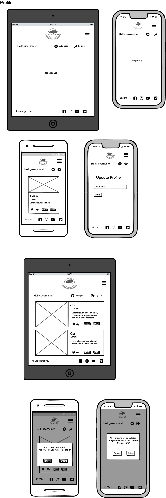

Contact Us

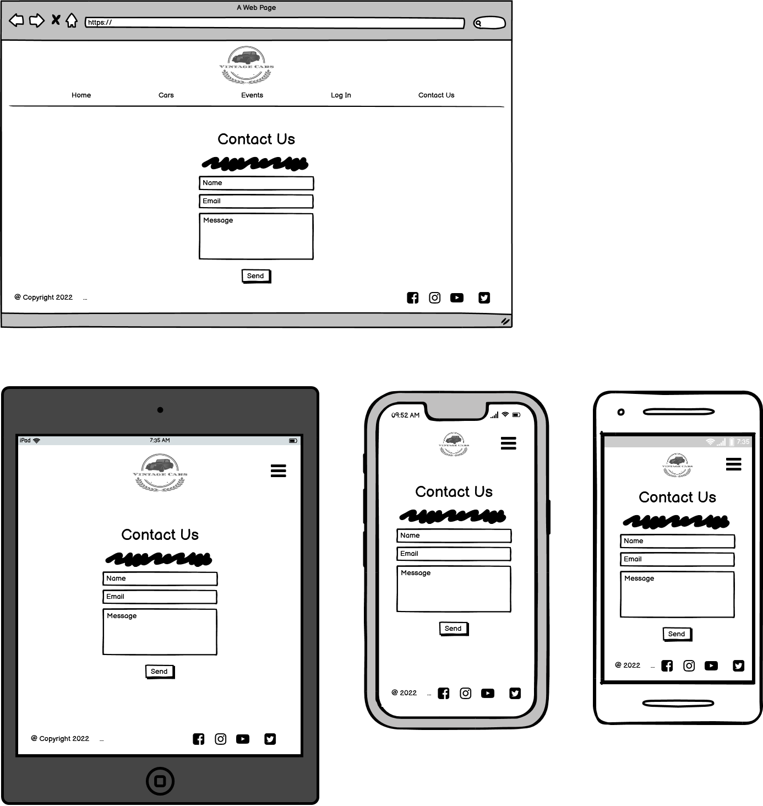

 

[Back to Top](#table-of-contents)
 
## Technology Used
 
#### Languages, Frameworks, Editors & Version Control:
 
* Core languages
   - HTML & CSS: For the main structure of the contents and style
   - Javascript: for a dynamic control of objects and elements in the webpage
   - Python: Object-oriented programming language

* [Django](https://www.djangoproject.com/) is a high-level Python web framework that encourages rapid development and clean, design. It's free and open source.

* [Bootstrap](https://getbootstrap.com/) a front-end framework used to style the project.

* [Gitpod](https://www.gitpod.io/) is an IDE using VS Code for remote development.

* [Git](https://git-scm.com/) is used for version control.

* [Github](https://github.com/) is used to host the project repository and linked to heroku

* [Heroku](https://www.heroku.com/) is a container-based cloud Platform to deploy and manage apps. Used to deploy this project.

 
#### Tools Used:
 
* Balsamiq: for wireframes creations.

* PostgreSql: an open source relational database. Used throughout the project.

* Cloudinary to store files for the webpage.

* Logo Maker: a mobile app used to create the logo and the heading of some pages of this project.

* [Removebg](https://www.remove.bg/) is an online application to remove image background. It's fast and free.

* [Iloveimg](https://www.iloveimg.com/) is an online photo editor used to edit and crop images for this project.

* [Online Gif Tools](https://onlinegiftools.com/create-transparent-gif) an online GIF transparency maker utility. Used to remove annoying background of some gif used in this project.

* Grammarly to spell check any grammar error for this project.

* Gmail is used to send and recieve email when user sends a message.

* Emailjs is used to send automatic emails by creating templates and use Javascript to send emails.

* Fontawesome for the icons.

* Hover CSS for the hover effects of the icons.

* [Sweetalert2](https://sweetalert2.github.io/) is used to prompt a very attractive and responsive alert using Javascript. Used CDN to include it to the project.

* JQuery is a lightweight JavaScript library. Used to create datepicker for this project and for manipulation and event handling.

* [dbdiagram](https://dbdiagram.io) to create database schema.

* ColorZilla is an eyedropper extension that assists web developers and graphic designers with color related tasks. Used in this project to pick colors.

* Amiresponsive to mockup the webpage responsive design.

* Validator used:
   - [W3C Markup Validator](https://validator.w3.org/)
   - [W3C CSS Validator](https://validator.w3.org/)
   - [JSHint](https://jshint.com/)
   - [PEP8 Validator](http://pep8online.com/)
 
## Database

#### Database Schema:

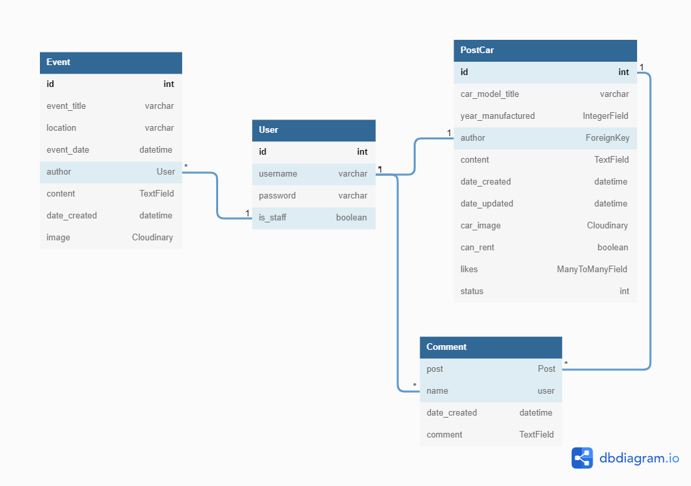

PostgreSql is used throughout the project by the help of Heroku addons. The database schema is drafted which serves as a guide before making the view models. The database consists of 4 tables: User, PostCar, Comment, and Event.
 
When a user is created, the username is the foreignKey for the PostCar that serves as the author of the post. Each post created by a user has an id that is used as the foreignKey of the comment and for CRUD funtionality.
 
If a user is a staff member, this user can create, update, and delete events. But anyone, generic and registered users can view them, as well as the classic car posts.
 
Time was running out fast, so I did some model modifications at the last minute. But it didn’t affect the final result.
 
## Features

### Navigation bar and Logo

The navbar is responsive and the logo serves as the home botton.

Responsive navbar

### Home page
The home page has 3 sections. The top section has a carousel for a sneak peek of some photos of classic cars with a brief introduction about the page. The middle sectio is about the page explaining the purposes and what users can obtain from the site. And the last section is a short information note on how to rent these cars.

 

### The Cars page

The first thing that shows when the page is opened are the lists of cars that all users had published in the site.  A filter bar is available on this page so that users can find any post they are interested in. Django-filter is used for this feature. Can be filtered by name, year of manufacture (min and max) or if the car is available for rent. 

When the mouse is on top of each post or a post is selected (small and medium devices), the image has a zoom out effect and the view options pops up. This icon opens the entire post content. The title serves as a link to open the post too.
 
Just like in the home page, the first thing shown when a user opens the post is the image uploaded by the author. The name of the car serves as the title of the post. But it could be anything that the author wants. This goes just on the bottom part of the image along with the name of the author, the year of manufacture, the date created and the date updated.
 
The content goes beneath the image. It can be styled and other photos can be attached in the content thanks to the editor included in the form, Summernote. If a user is logged in, this user can give a like on the post or a comment. And if the car is available for rent, a button is enabled to contact the administrator of the website. Underneath are the list of comments. The comment field is set to prevent users from posting empty comments by adding the `required` attribute and setting it to `true`.

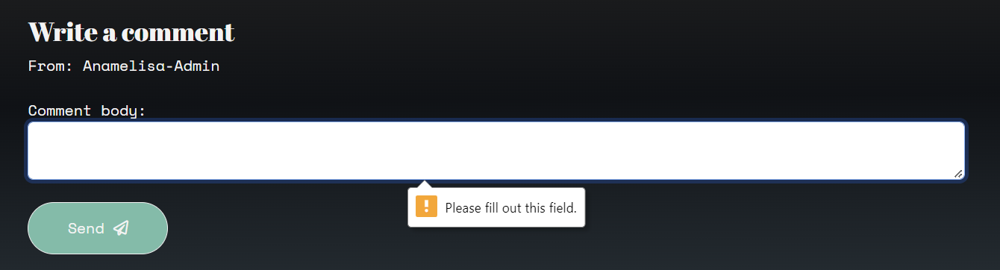

 

### The Profile page
When the user is not logged in, navbar shows the option to log in. And on the contrary, if the user is logged in the Profile option is shown.
Below the main navbar is another navbar that contains the username, the add post button and the logout button if the user is logged in or the login button if the user is not.

Inside this page, it displays the list of all the posts that the user had published and those posts that are left as draft.
A filter is added to this page so that the user can easily find any post by the name, the status (draft or published), and filter the cars whether it’s available for rent or not.

Each card post has different buttons to view, edit or delete posts. The view redirects the same as the view function from the cars page. The edit function gets the instance of the post to be edited and saved. The post deletes completely from the page.

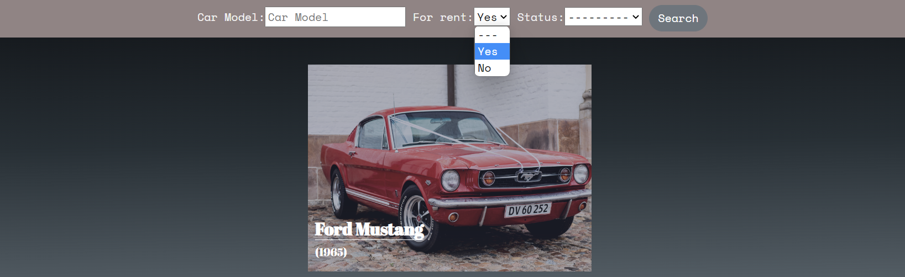

 

### The Event page

 
The event page has the same feature as the car blog post. The only difference is that events can only be created by staff members. Admin users can create an event post, edit an event, and delete it. The add event button is at the bottom of the page to give it another style. With the help of my mentor I manage to add login required to each of the views (create, update, delete) and add permission required mixin in the Event app so that non-staff users and non-registered users cannot access any of the posts. I added the same code to the Cars app to prevent other users from updating or deleting other users posts and redirecting them to their own profile page.

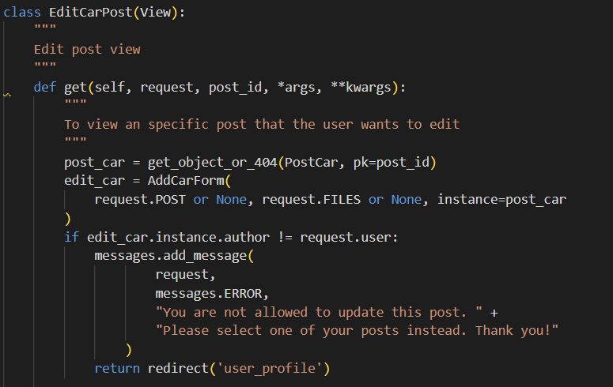

 

### The sign up, login and logout

I kept the sign up form as simple as possible. New users can register by clicking the sign up button on the profile page. 

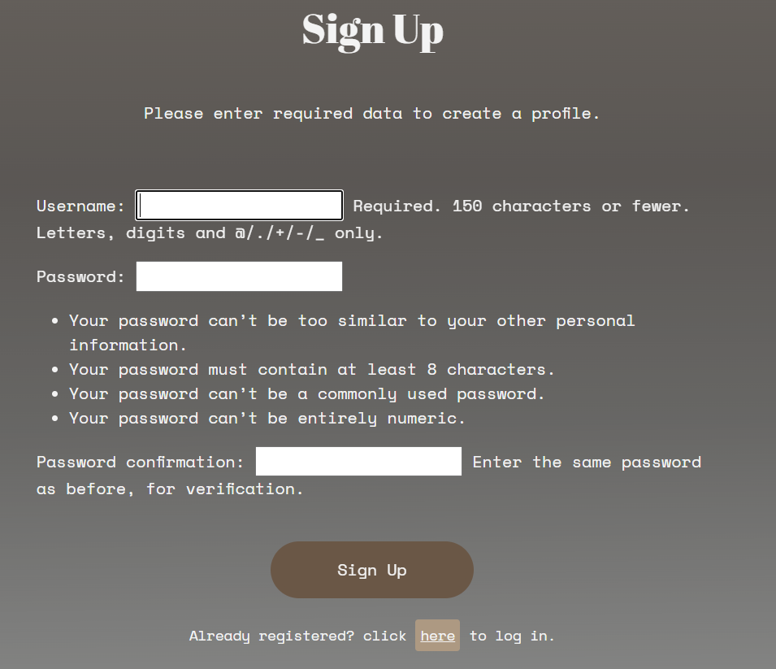

When the user is already registered, just click the login button on the profile navbar button.

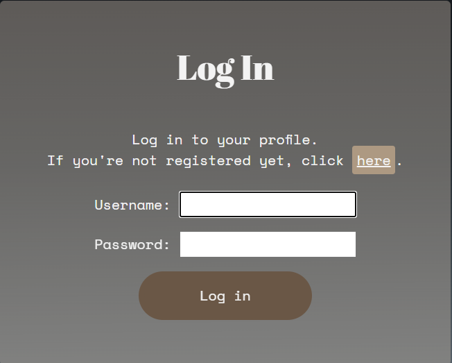
 
To logout, a button is enabled beside the add post button on the profile navbar.

static/images/screenshots/screenshot-logout-profile.png
[Back to Top](#table-of-contents)

 

### Contact Us page

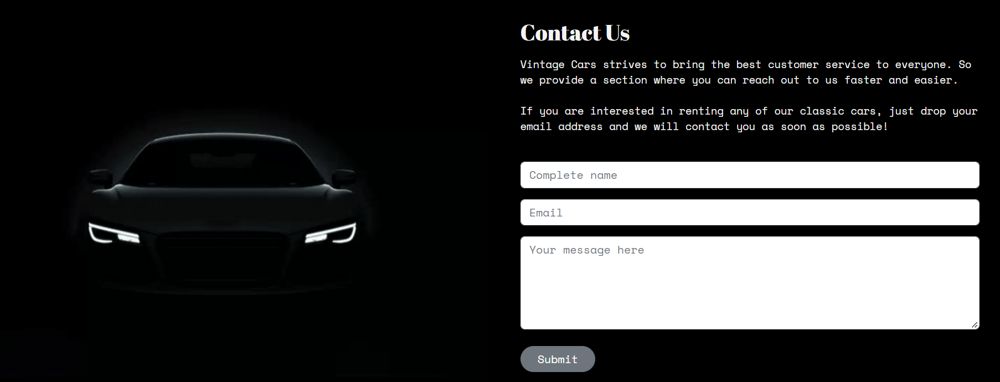

This page is accessible from the main navbar. Anyone who wants to enquire or anyone who clicked the button `rent a car` from the post detail will be redirected to this page so they can fill up this form and the administrator will receive an email with all the data provided. And at the same time the user who fills up the form will receive an email response. Emailjs is used for this functionality.

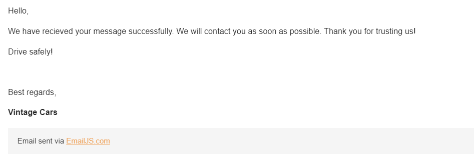

 
#### Future Features:
 
* Detail future implementations here...
 
## Testing
 
Testing was ...
 
#### Found Bugs and Fixes:
 
During manual testing...
 
[Back to Top](#table-of-contents)
 
#### Defensive Design
 
Defensive design for this application was...
 
## Deployment
 
Detail deployment here...
 
[Back to Top](#table-of-contents)
 
## Credits
 
* background fix= https://css-tricks.com/perfect-full-page-background-image/
 
[Back to Top](#table-of-contents)
 
#### Special Thanks & Acknowledgements:
 
* Team 11 🤜
 
###### <i>Disclaimer: This project was created for educational use only as part of Code Institute's __________</i>
 
[Back to Top](#table-of-contents)