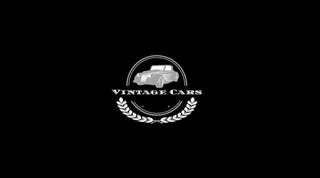

# Vintage Cars
***
 
## Table of Contents:
* [What does it do and what does it need to fulfill?](#what-does-it-do-and-what-does-it-need-to-fulfill)
* [Functionality of Project](#functionality-of-project)
* [User Experience](#user-experience)
   * [User Stories](#user-stories)
   * [Design](#design)
       * [1. Font](#1-font)
       * [2. Color Scheme](#2-color-scheme)
       * [3. Logo](#3-logo)
       * [4. Geometry](#4-geometry)
       * [5. Wireframing](#5-wireframing)
* [Technology Used](#technology-used)
* [Database](#database)
* [Features](#features)
   * [Future Features](#future-features)
* [Testing](#testing)
   * [Defensive Design](#defensive-design)
* [Deployment](#deployment)
* [Credits](#credits)
   * [Special Thanks & Acknowledgements](#special-thanks--acknowledgements)
 
***
 
## Welcome to Vintage Cars!

 
***
 
## What does it do and what does it need to fulfill?

Ever since automotives were invented, they were evolving very fast and even more environmentally friendly. But there are old cars that, though time already passes, are still as good as the modern ones. It’s good to point out that the world is accumulating a lot of garbage and, instead of scrapping the old unused cars, it should be integrated into circulation again but lessen their emission of contaminant gas.

With this project, I want to showcase the simplicity but elegant style of these cars and to be able to reuse these cars for different purposes and to promote them back into circulation with the help of modern technology. It's also a good opportunity for owners to gain cash by sharing their properties to avid fans of classic and vintage cars.

This project is to show how easy and fast a single framework can build a real-life website with complete functionality and libraries to choose from. Django is an open-source web framework that provides an easy and efficient way to create websites with minimum hassles. It comes with resources that are required by developers, specially those who are just starting their journey in Software Development.

### Favicon
I opted to use an image of a very well known classic car as the favicon of my project.

### Functionality of Project

There are different functionalities that are implemented in this project. One of them is to be able to register, to log in the registered username and to log out.

Any users, general users and registered users can view and read any post created. Those posts are created only by registered users. It can also be updated or deleted only by the author.

The Events section is integrated to the web page where anyone can browse to different upcoming events. Only admin staff can create, update and delete these posts. The rest of users can only read the content.
A contact page is available for anyone who wants to rent a car or has any enquiry regarding a car, a post or the webpage.

 
[Back to top](#table-of-contents)
 
## User Experience:
 
#### User Stories:
_Generic (Guest/Public) User:_
* As a Generic User, I want to browse through different types of classic cars.
* As a Generic User, I want to be able to filter out the cars that are available for rent.
* As a Generic User, I want to see reviews of some users in the comment section.
* As a Generic User, I want to be able to read about any upcoming event in the future.
* As a Generic User, I want to be able to rent my favorite car.
* As a Generic User, I want to contact the website for any enquiries.

 
_Registers (Logged in) User:_
* As a Registered User, I want to be able to enjoy a ride with my favorite classic cars by renting one anytime.
* As a Registered User, I want to enjoy the car without worrying about the car expenses and maintenance.
* As a Registered User, I want to be a part of a community of avid fans of classic and vintage cars.
* As a Registered User, I want to post, edit and delete a classic car.
* As a Registered User, I want to filter my posts so that I can manage them all, more especially those posts pending to be published.
* As a Registered User, I want to be able to view any upcoming event and be able to be part of it.
 
_Administrator:_
* As an Administrator, I want to promote a very friendly community who wants to help and share with other users.
* As an Administrator, I want to notify the whole community about upcoming events regarding classic cars anywhere.

_Developer:_
*As a Developer, I want to to be able to make a fully functioning webpage.
*As a Developer, I want to use and apply the different languages I learned.
*As a Developer, I want to upgrade my knowledge to gain more skills.

#### Design
 
##### 1. Font
lorem
 
##### 2. Color Scheme

 
This is the color scheme I selected for this project.
 
##### 3. Logo
The logo was ... add detail, or remove as necessary
 

 
##### 4. Geometry
 
The application's geometrical aspects...
 
##### 5. Wireframing
 
The wireframes were created for each individual page on three different screen sizes. All the wireframes are down below.
 

Wireframes

Home page
 

 
Wish tree page
 

 
Send wishes page
 

 
Login/Register page
 

 

 
[Back to Top](#table-of-contents)
 
## Technology Used
 
#### Languages, Frameworks, Editors & Version Control:
 
* add notes here on techstack...
 
#### Tools Used:
 
* add notes here on tools used to assist in developing the project...
 
## Database
 
#### Database Schema:
 
Detail the db schema here (if applicable)....images, thoughts behind fks etc
 
## Features
 
The project boasts several key features:
* Create: ...
 
[Back to Top](#table-of-contents)
 
#### Future Features:
 
* Detail future implementations here...
 
## Testing
 
Testing was ...
 
#### Found Bugs and Fixes:
 
During manual testing...
 
[Back to Top](#table-of-contents)
 
#### Defensive Design
 
Defensive design for this application was...
 
## Deployment
 
Detail deployment here...
 
[Back to Top](#table-of-contents)
 
## Credits
 
* background fix= https://css-tricks.com/perfect-full-page-background-image/
 
[Back to Top](#table-of-contents)
 
#### Special Thanks & Acknowledgements:
 
* Team 11 🤜
 
###### <i>Disclaimer: This project was created for educational use only as part of Code Institute's __________</i>
 
[Back to Top](#table-of-contents)